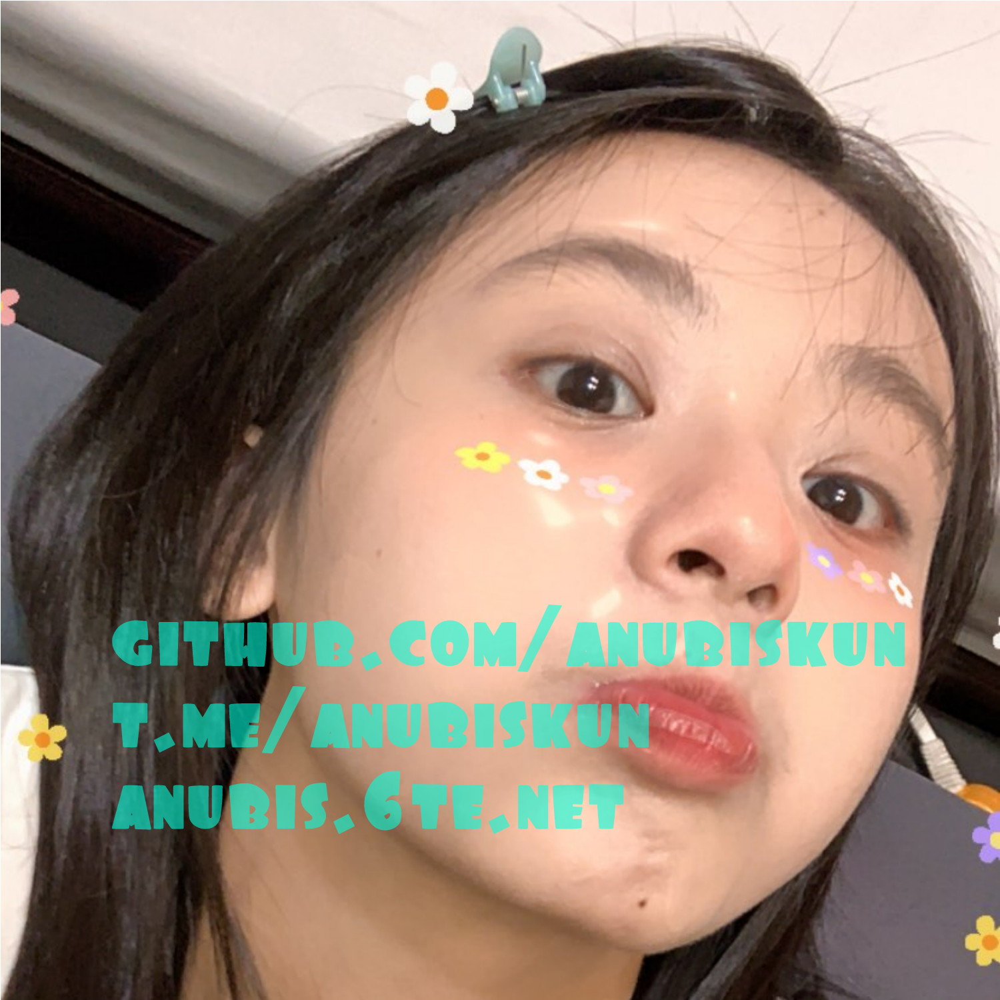

[![website][web-l]][web-url]
[![github][github-l]][github-url]
[![telegram][tg-l]][tg-url]


<!-- PROJECT LOGO -->
<br />
<p align="center">
  <a href="https://github.com/anubiskun/repo">
    
  </a>

  <h3 align="center">SSH CREATOR</h3>

  <p align="center">
    <a href="http://anubiskun.6te.net"><strong>Explore the docs ?</strong></a>
    <br />
    <a href="https://t.me/anubiskun">Report Bug</a>
  </p>
</p>

### Installation
1. Install Python
   ```sh
   pkg install python
   ```
2. Install Git
   ```sh
   pkg install git
   ```
3. Install requests, bs4, BeautifulSoup4
   ```sh
   python -m pip install requests
   ```
   ```sh
   python -m pip install bs4
   ```
   ```sh
   python -m pip install beautifulsoup4
   ```
4. Clone the repo
   ```sh
   git clone https://github.com/anubiskun/ssh-creator.git
   ```
5. go to directory ssh creator
   ```sh
   cd ssh-creator
   ```
6. Run ssh.py
   ```sh
   python ssh.py
   ```

<!-- custom regex -->
[tg-l]: https://img.shields.io/badge/-Telegram-black.svg?style=for-the-badge&logo=telegram&colorB=555
[tg-url]: https://t.me/anubiskun
[github-l]: https://img.shields.io/badge/-Telegram-black.svg?style=for-the-badge&logo=github&colorB=555
[github-url]: https://github.com/anubiskun
[web-l]: https://img.shields.io/badge/-website-black.svg?style=for-the-badge&logo=world&colorB=555
[web-url]: http://anubis.6te.net
